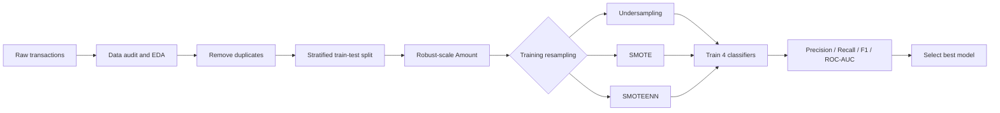

# Credit Card Fraud Detection

---

[](https://www.python.org/)
[](https://scikit-learn.org/)
[](https://xgboost.readthedocs.io/)
[](https://jupyter.org/)

An end-to-end machine-learning project for detecting fraudulent credit card
transactions in severely imbalanced data. It audits and explores 284,807
transactions, compares three resampling strategies across four classifiers, and
selects the strongest model using precision, recall, F1-score, and ROC-AUC
rather than misleading raw accuracy.

[Explore the notebook](./Fraud%20Detection.ipynb) | [Get the dataset](https://www.kaggle.com/datasets/mlg-ulb/creditcardfraud) | [View results](#model-performance)

> [!IMPORTANT]
> Fraud predictions should support, not replace, analyst review and human
> judgment. Validate model outputs and investigate flagged transactions before
> taking action that affects a customer.

## Overview

Credit card fraud detection is an extreme class-imbalance problem: only **492 of
284,807 transactions (0.173%)** in this dataset are fraudulent. A model can
achieve more than 99% accuracy by predicting every transaction as legitimate,
so this project focuses on metrics that measure useful fraud detection:
**precision, recall, F1-score, and ROC-AUC**.

The notebook covers data validation, exploratory analysis, leakage-safe
preprocessing, imbalance handling, model training, and comparative evaluation.

### At a glance

| Dataset | Models | Sampling strategies | Best experiment |
|:--|:--|:--|:--|
| 284,807 transactions | Logistic Regression | Random Undersampling | Random Forest |
| 30 input features | Decision Tree | SMOTE | SMOTEENN |
| 492 fraud cases | Random Forest | SMOTEENN | **F1: 0.8352** |
| 0.173% fraud rate | XGBoost | | **AUC: 0.9655** |

## Workflow



> Resampling and scaler fitting are performed on the training partition. The
> held-out test set remains untouched for final comparison.

## Model performance

### Best overall model

**Random Forest + SMOTEENN** produced the highest F1-score, balancing fraud
detection coverage with a low false-alert rate.

| Precision | Recall | F1-score | ROC-AUC |
|---:|---:|---:|---:|
| **0.8736** | **0.8000** | **0.8352** | **0.9655** |

### Leading experiments

| Rank | Sampling | Model | Precision | Recall | F1-score | ROC-AUC |
|---:|:--|:--|---:|---:|---:|---:|
| 1 | SMOTEENN | Random Forest | 0.8736 | 0.8000 | **0.8352** | 0.9655 |
| 2 | SMOTE | Random Forest | **0.9125** | 0.7684 | 0.8343 | 0.9545 |
| 3 | SMOTE | XGBoost | 0.7475 | 0.7789 | 0.7629 | 0.9634 |
| 4 | SMOTEENN | XGBoost | 0.7196 | **0.8105** | 0.7624 | 0.9637 |

<details>
<summary><strong>View all 12 experiment results</strong></summary>

<br>

| Sampling | Model | Precision | Recall | F1-score | ROC-AUC |
|:--|:--|---:|---:|---:|---:|
| SMOTEENN | Random Forest | 0.8736 | 0.8000 | 0.8352 | 0.9655 |
| SMOTE | Random Forest | 0.9125 | 0.7684 | 0.8343 | 0.9545 |
| SMOTE | XGBoost | 0.7475 | 0.7789 | 0.7629 | 0.9634 |
| SMOTEENN | XGBoost | 0.7196 | 0.8105 | 0.7624 | 0.9637 |
| SMOTEENN | Decision Tree | 0.3613 | 0.7263 | 0.4825 | 0.8621 |
| SMOTE | Decision Tree | 0.3516 | 0.6737 | 0.4621 | 0.8358 |
| Undersampling | Random Forest | 0.0792 | 0.8632 | 0.1450 | 0.9746 |
| SMOTE | Logistic Regression | 0.0536 | 0.8737 | 0.1010 | 0.9595 |
| SMOTEENN | Logistic Regression | 0.0527 | 0.8737 | 0.0994 | 0.9596 |
| Undersampling | XGBoost | 0.0510 | 0.8632 | 0.0963 | **0.9766** |
| Undersampling | Logistic Regression | 0.0501 | 0.8737 | 0.0948 | 0.9547 |
| Undersampling | Decision Tree | 0.0190 | 0.9158 | 0.0373 | 0.9183 |

</details>

The highest ROC-AUC came from undersampled XGBoost, but its precision of 0.0510
would create too many false alerts. Selecting by F1-score gives a more practical
balance for this experiment.

## Dataset

The project uses the public
[Credit Card Fraud Detection dataset](https://www.kaggle.com/datasets/mlg-ulb/creditcardfraud),
containing European cardholder transactions collected over two days in
September 2013.

| Field | Description |
|:--|:--|
| `Time` | Seconds elapsed since the first recorded transaction |
| `V1` - `V28` | PCA-transformed numerical features |
| `Amount` | Transaction value |
| `Class` | Target: `0` legitimate, `1` fraudulent |

The dataset is not committed because `creditcard.csv` is approximately 151 MB,
which exceeds GitHub's standard per-file limit.

## Quick start

### Prerequisites

- Python 3.10 or newer
- Git
- The downloaded Kaggle dataset

### Installation

```bash
git clone https://github.com/Nour-Elrouby/Credit-Card-Fraud-Detection.git
cd Credit-Card-Fraud-Detection

python -m venv .venv
```

Activate the environment:

```bash
# Windows PowerShell
.venv\Scripts\Activate.ps1

# macOS / Linux
source .venv/bin/activate
```

Install the dependencies:

```bash
python -m pip install --upgrade pip
pip install -r requirements.txt
```

Download `creditcard.csv` from Kaggle, place it in the project root, and launch:

```bash
jupyter notebook "Fraud Detection.ipynb"
```

## Repository structure

```text
Credit-Card-Fraud-Detection/
|-- Fraud Detection.ipynb   # Complete analysis and model comparison
|-- requirements.txt        # Python notebook dependencies
|-- .gitignore              # Local data and generated-file exclusions
`-- README.md               # Project documentation
```

## Technical approach

| Stage | Implementation |
|:--|:--|
| Validation | Schema inspection, null checks, duplicate checks, class counts |
| Exploration | Class distribution, pair plots, correlations, feature relationships |
| Cleaning | Duplicate removal and `Time` feature removal |
| Preprocessing | Stratified 80/20 split and `RobustScaler` for `Amount` |
| Imbalance handling | `RandomUnderSampler`, `SMOTE`, and `SMOTEENN` |
| Models | Logistic Regression, Decision Tree, Random Forest, XGBoost |
| Evaluation | Confusion matrices, precision, recall, F1-score, ROC curves, ROC-AUC |

## Key findings

- Accuracy is unsuitable as the main metric for a dataset this imbalanced.
- Random Forest was the most effective classifier by F1-score after SMOTE-based
  resampling.
- Undersampling improved recall and ROC-AUC for some models but sharply reduced
  precision.
- Ensemble models consistently offered a stronger precision-recall trade-off
  than a single Decision Tree.
- A production system should tune its decision threshold using the financial
  costs of missed fraud and false alerts.

## Next steps

- Hyperparameter tuning with stratified cross-validation
- Precision-recall curve and probability calibration analysis
- Cost-sensitive learning and business-aware threshold optimization
- Time-aware validation to detect performance drift
- A versioned preprocessing and inference pipeline
- Model monitoring and explainability for analyst review

---

<div align="center">
Built by <a href="https://github.com/Nour-Elrouby">Nour Elrouby</a>
</div>
